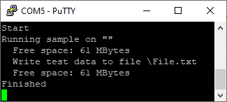
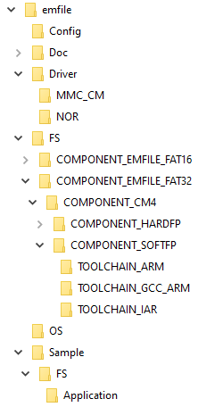

# SEGGER emFile for ModusToolbox User Guide

## Overview

[emFile](https://www.segger.com/products/file-system/emfile) is a fail-safe filesystem designed for embedded systems by SEGGER Microcontroller GmbH that can be used with different types of storage devices. It is a high-performance library optimized for high speed, versatility, and a minimal memory footprint of both RAM and ROM. Cypress has licensed emFile from SEGGER and offers it for free to its customers. This middleware library provides emFile in the form of pre-built libraries and supports FAT 12/16/32 file systems.

## Quick Start

The following step-by-step instructions show how to perform simple filesystem operations on an SD card for the CY8CPROTO-062-4343W kit. Adapt the instructions for your target kit as required.

1. Open the Project Creator tool in ModusToolbox&trade; by clicking the **New Application** menu in **Quick Panel**

2. Choose CY8CPROTO-062-4343W under **PSoC 6 BSPs** and click **Next**

3. Select *Empty PSoC6 App* under **Template Applications** and click **Create**. Close the window after the application has been created.

4. Open the **Library Manager** tool from the Quick Panel.

5.  Select *emFile* under **PSoC 6 Middleware** and *retarget-io* under **Board Utils** and click **Update**. Close the window after the libraries have been added.

6. Copy the following files from the emFile directory into the application directory:

   - *Sample/FS/Application/FS_Start.c* - Implements a starter application that performs simple read and write operations
   - Either of the following files depending on the storage device you want to use
        - *Config/FS_ConfigNOR_BM_SPIFI.c* - For working with the NOR flash. Most of the PSoC 6 MCU development kits have an on-board NOR flash.
        - *Config/FS_ConfigMMC_CM_HS.c* - For working with an SD card

7. Add `COMPONENTS=EMFILE_FAT32` and `DEFINES=CY_RETARGET_IO_CONVERT_LF_TO_CRLF` in the Makefile.

8. Add `#include "cy_retarget_io.h"` to *main.c*.

9. Add `void MainTask(void);` above the `main()` function.

10. Add the following code in `main()` after the line `__enable_irq();`

    ```c++
    /* Initialize retarget-io to use the debug UART port */
    cy_retarget_io_init(CYBSP_DEBUG_UART_TX, CYBSP_DEBUG_UART_RX, CY_RETARGET_IO_BAUDRATE);

    /* Call the function that performs emFile operations */
    MainTask();
    ```

11. Open a serial terminal.

12. Build the application and program the kit.

    Output on the serial terminal appears as follows:

    


## Configuration Considerations

### Picking an emFile Library Variant

This middleware provides emFile as pre-built libraries in 12 variants. These libraries are available under the *FS/\<lib_path>* directory where *\<lib_path>* is constructed as follows: *COMPONENT_\<config>/COMPONENT_\<cpu>/COMPONENT_\<vfp_select>/TOOLCHAIN_\<toolchain>/*. The table below lists the options for each field and the related make variable. You can pick a variant by correctly configuring the make variables.

| Field      | Options                    | Make Variable |
| ---------- | -------------------------- | ------------- |
| *config*     | `EMFILE_FAT32`, `EMFILE_FAT16` | `COMPONENTS`    |
| *cpu*        | `CM4`                        | `CORE`          |
| *vfp_select* | `HARDFP`, `SOFTFP`             | `VFP_SELECT`    |
| *toolchain*  | `GCC_ARM`, `IAR`, `ARM`          | `TOOLCHAIN`     |

The header file *FS_ConfCommon.h* under the *FS* directory contains the common configuration used in generating the libraries. Similarly, *FS_Conf.h* under each *COMPONENT_\<config>* directory contains the configuration specific to the set of library variants.

### Using emFile in an RTOS Environment

The OS layer and the HW layer implementations use the [abstraction-rtos](http://github.com/cypresssemiconductorco/abstraction-rtos) library for implementing RTOS functionalities. Therefore, emFile can be used with the RTOSes supported by the abstraction-rtos library. Do the following to configure your application for using emFile with FreeRTOS.

1. Open Library Manager and add FreeRTOS to your project.

2. Copy *FreeRTOSConfig.h* from *\<freertos_dir>/Source/portable/COMPONENT_CM4* into the application directory and configure it.

3. Add `COMPONENTS=FREERTOS RTOS_AWARE` in the Makefile.

### Configuring the HW Layer for the Block Map NOR Driver (NOR_BM)

Configure the HW layer for the Block Map NOR driver in `FS_X_AddDevices()` before adding the driver using `FS_AddDevice()`. See the [*FS_ConfigNOR_BM_SPIFI.c*](../Config/FS_ConfigNOR_BM_SPIFI.c) file that shows how to configure the HW layer.

1. Create an instance (for example: `QspiConfig`) of the configuration structure `FS_NOR_HW_SPIFI_Config_t` and assign the values. See the [*FS_NOR_HW_SPIFI.h*](../Driver/NOR/FS_NOR_HW_SPIFI.h) file for the structure documentation.

2. Call `FS_NOR_HW_SPIFI_Configure()` to configure the HW layer. For example: `FS_NOR_HW_SPIFI_Configure(&QspiConfig);`.

    **Note:** The NOR HW layer supports up to four memories using four slave select pins but all the memories need to be connected to the same data lines.

3. Add the driver using `FS_AddDevice()` and proceed with the rest of the initialization.

### Configuring the HW Layer for the Card Mode SD/MMC Driver (MMC_CM)

Configure the HW layer for the SD/MMC driver in `FS_X_AddDevices()` before adding the driver using `FS_AddDevice()`. See the [*FS_ConfigMMC_CM_HS.c*](../Config/FS_ConfigMMC_CM_HS.c) file that shows how to configure the HW layer.

1. Create an instance (for example: `SDConfig`) of the configuration structure `FS_MMC_HW_CM_SDHostConfig_t` and assign the values. See the [FS_MMC_HW_CM.h](../Driver/MMC_CM/FS_MMC_HW_CM.h) file for the structure documentation.

    **Note:**

    - In the configuration structure, you must set the `isEmmc` member of `cyhal_sdhc_config_t` to `true` if you are using an eMMC card instead of an SD card.

2. Call `FS_MMC_HW_CM_Configure()` to configure the HW layer. For example: `FS_MMC_HW_CM_Configure(0, &SDConfig);`.

   The first argument is the HW/driver instance number. Up to 2 instances are supported.

3. Add the driver using `FS_AddDevice()` and proceed with the rest of the initialization.

## emFile Package Structure

<div>
<p>
<b>Config:</b> Contains the sample configuration files for the various drivers and *FS_ConfigRAMDisk.c* that allows using RAM as a storage device.

<b>Doc:</b> Contains this user guide, SEGGER-provided emFile user guide and release notes.

<b>Driver:</b> Contains the HW layer implementations for the various drivers.

<b>FS:</b> Contains the header files and the pre-built emFile libraries. See <b>Picking an emFile Library Variant</b> for details.

<b>OS:</b> Contains the OS layer implementation.

<b>Sample/FS/Application:</b> Contains the readily-usable sample emFile applications provided by SEGGER. You can copy any of the files into your application directory and call <i>MainTask()</i> in the <i>main()</i> function to run the application.

<b>Note:</b> The folders <i>Config</i> and <i>Sample</i> have been added to the .cyignore file and hence will be excluded from the build.
</p>
</div>

---
© 2021 Cypress Semiconductor Corporation, an Infineon Technologies Company.
